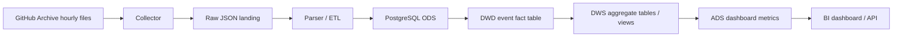

# 架构设计

## 设计目标

本项目面向个人项目展示，需要兼顾完整度、可运行性和讲述价值。首版不追求复杂的大数据平台，而是用 PostgreSQL 完成核心链路，再预留向 ClickHouse、Kafka、Flink 等组件升级的空间。

## 数据链路

## 分层说明

- Raw：保存原始 JSON 或原始 gzip 文件路径，便于重放和排错。
- ODS：轻度结构化后的原始事件表，尽量保留事件原貌。
- DWD：清洗后的明细事实表，例如 `github_event`。
- DWS：按项目、开发者、语言、事件类型、时间窗口聚合后的宽表或物化视图。
- ADS：面向报表与接口的指标结果。

## 首版架构选择

推荐先使用：

- Python collector：按小时下载 GitHub Archive 文件，记录采集状态。
- PostgreSQL：统一存储明细、聚合与报表视图。
- SQL views/materialized views：快速建设指标。
- Docker Compose：降低运行门槛。

这个选择的优点是实现快、部署简单、调试直接，非常适合个人项目第一阶段。后续数据量变大后，可将分析存储迁移到 ClickHouse，将采集链路升级为 Kafka + Flink。

## 近实时说明

GitHub Archive 通常以小时文件形式发布公开事件数据，因此首版定义为小时级近实时。实时事件展示可以展示数据库中最新入库事件。若后续需要秒级体验，可以增加 GitHub Events API 作为热数据源，再由 GitHub Archive 做最终补数。

## 核心模块

- collector：负责按小时拉取数据、断点续采、失败重试。
- parser：解析不同事件类型，抽取通用字段与事件特有字段。
- loader：批量写入 PostgreSQL，支持幂等。
- metrics：维护指标 SQL、视图和物化视图刷新逻辑。
- dashboard：展示核心指标与实时事件流。

